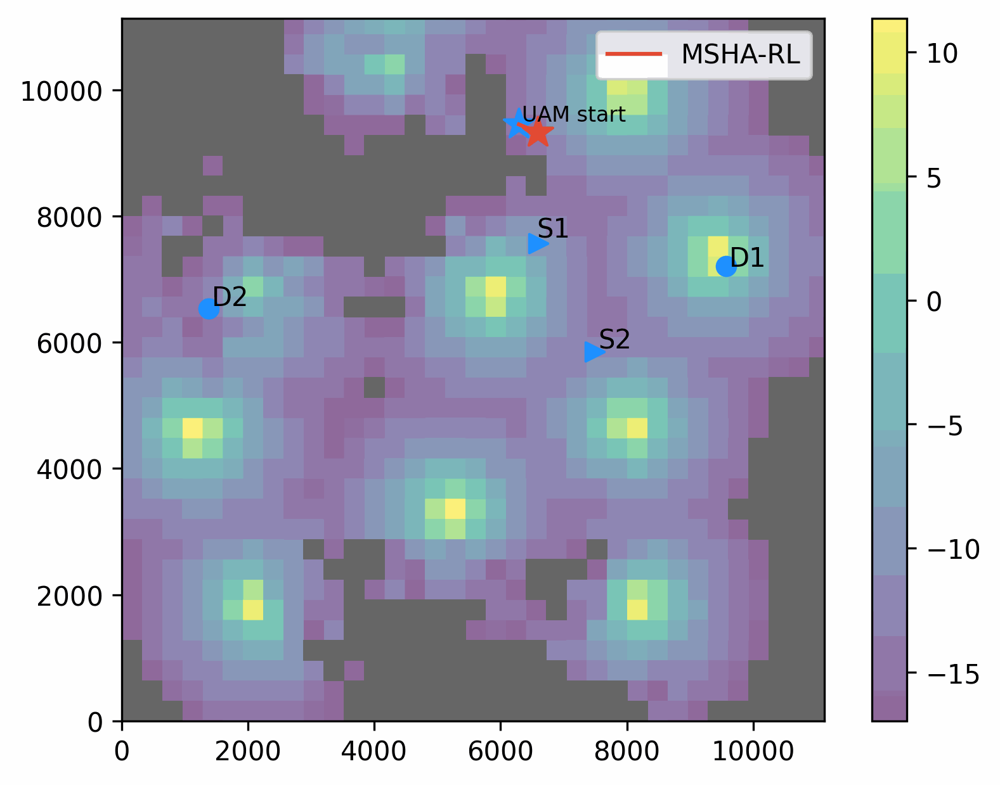

# UAM-Path-Planning
# Paper
**Real-Time Communication-Aware Ride-Sharing Route Planning for Urban Air Mobility: A Multi-Source Hybrid Attention Reinforcement Learning Approach,**
accpeted by ICC 2025.
## Overview  
This work proposed a novel Multi-Source Hybrid Attention Reinforcement Learning (MSHA-RL) framework to solve the real-time communication-aware path planning for UAM as an "air-taxi".

## Demo

### Case 1  
<p align="center">
  
</p>
*Threshold SINR = -3 dB, in Berlin, Germany*

### Case 2  
<p align="center">
  
</p>
*Threshold SINR = -17 dB, in Detroit, USA*

## Quick start:
### 1. Install TransSimHub
```bash
git clone https://github.com/Traffic-Alpha/TransSimHub.git
cd TransSimHub
pip install -e .  # Install in editable mode
```

### 2. Install UAM-Path-Planning
```bash
git clone https://github.com/Traffic-Alpha/UAM-Path-Planning.git
cd UAM-Path-Planning
pip install -r requirements.txt
```

### 3. Train RL
You can train the RL model with the following code:
```bash
python train_sigppo.py
```


